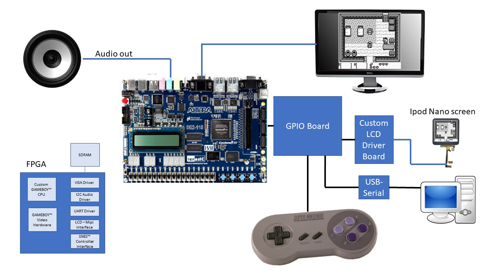

# FPGA_Gameboy_Watch
Full gameboy and gameboy color Verilog Implenentation

This project is at about 80% complete.  Most gameboy roms work, gameboy color features are 80% implemented.

Remaining (besides refactoring and checking in modules)
  Debugging 
  Gameboy color tile flips for background tiles
  External ram support for larger than 256K roms (512k roms work but not enough internal bram from 512k rom AND gameboy color features)

 [video 1](https://www.youtube.com/watch?v=Pr7vuAg85WQ&t=10s)
 
 [video 2](https://www.youtube.com/watch?v=uc7wt_IBnak)
 
This project was started a long time ago...and my coding style and abilities have changed quite a bit in that time...this does make things a bit inconsistant at times and I am slowly refactoring that.  
  